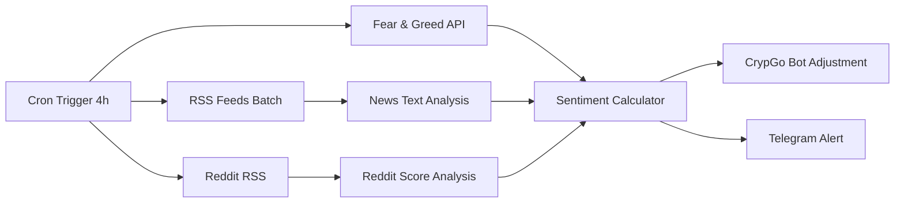

# 🤖 N8N Automation Ideas para CrypGo Trading Bot

## 📋 Overview

Este documento apresenta ideias e casos de uso para automações usando N8N no contexto do sistema de trading de criptomoedas CrypGo Machine. O N8N permite criar workflows visuais que conectam diferentes serviços e APIs para automatizar processos complexos.

## 🔗 Informações de Acesso

- **URL**: http://31.97.249.4:8081/
- **Credenciais**: admin / CrypGoN8N2024!
- **Documentação**: [N8N_SETUP.md](./N8N_SETUP.md)

## 🎯 Categorias de Automação

### 1. 📢 Notificações e Alertas

#### A. Notificações de Trading em Tempo Real
- **Trigger**: Webhook do CrypGo quando há BUY/SELL
- **Ações**:
  - Enviar mensagem no Telegram com detalhes da operação
  - Post no Discord com embed rico (preço, símbolo, lucro/prejuízo)
  - Email formatado para operações importantes
  - SMS para alertas críticos (perdas > 5%)

#### B. Relatórios Diários/Semanais
- **Trigger**: Cron schedule (diário 08:00, semanal domingo)
- **Dados coletados**:
  - Performance geral dos bots
  - P&L do período
  - Trades executados
  - Símbolos mais rentáveis
- **Envio**: Email formatado, Google Sheets, Slack

#### C. Alertas de Performance
- **Triggers**:
  - Bot com prejuízo > X% em Y horas
  - Bot parado inesperadamente
  - Falha de conexão com Binance
  - Volume de trades muito baixo
- **Ações**:
  - Notificação urgente no WhatsApp
  - Log em sistema de monitoramento
  - Parar bots automaticamente se necessário

### 2. 📊 Análise e Reporting

#### A. Dashboard Automático no Google Sheets
- **Workflow**:
  1. Coletar dados via API do CrypGo a cada hora
  2. Processar métricas (ROI, Sharpe Ratio, Max Drawdown)
  3. Atualizar Google Sheets com dados formatados
  4. Gerar gráficos automáticos
  5. Compartilhar relatório via email

#### B. Análise de Market Sentiment (Detalhado)
**Objetivo**: Coletar dados de sentimento do mercado crypto via scraping/RSS para ajustar automaticamente a agressividade dos bots.

##### 📊 **Fontes de Dados (Sem APIs Pagas)**

###### 1. **Fear & Greed Index**
- **URL**: `https://api.alternative.me/fng/`
- **Método**: HTTP GET simples (API pública gratuita)
- **Frequência**: Diária
- **Dados**: Índice 0-100 (Extreme Fear → Extreme Greed)
- **N8N Node**: HTTP Request → JSON parse
```json
{
  "name": "Fear and Greed Index",
  "data": [{"value": "25", "value_classification": "Extreme Fear"}]
}
```

###### 2. **News Sentiment via RSS Feeds**
- **CoinDesk RSS**: `https://www.coindesk.com/arc/outboundfeeds/rss/`
- **CoinTelegraph RSS**: `https://cointelegraph.com/rss`
- **Bitcoin.com RSS**: `https://news.bitcoin.com/feed/`
- **Decrypt RSS**: `https://decrypt.co/feed`
- **Método**: RSS Reader → Text Analysis
- **Frequência**: A cada 2-4 horas
- **Sentiment**: Palavras-chave positivas/negativas

**Palavras-chave Sentiment Analysis**:
```javascript
// Positivas: "bullish", "rally", "surge", "adoption", "institutional"
// Negativas: "crash", "dump", "regulation", "ban", "bearish"
// Neutras: "analysis", "prediction", "market", "trading"
```

###### 3. **Reddit r/cryptocurrency via RSS**
- **URL**: `https://www.reddit.com/r/cryptocurrency/hot/.rss`
- **Posts populares**: `https://www.reddit.com/r/cryptocurrency/top/.rss?t=day`
- **Método**: RSS Feed → Title/Description parsing
- **Frequência**: A cada hora
- **Sentiment**: Análise de títulos + score (upvotes/downvotes ratio)

###### 4. **Social Media Alternatives (Sem Contas Dev)**

**Google Trends (Crypto Keywords)**:
- **URL**: `https://trends.google.com/trends/trendingsearches/daily/rss?geo=US`
- **Keywords**: "Bitcoin", "Crypto", "Ethereum"
- **Método**: RSS + keyword matching

**YouTube Sentiment (Via RSS)**:
- **Channels RSS**: 
  - Coin Bureau: `https://www.youtube.com/feeds/videos.xml?channel_id=UCqK_GSMbpiV8spgD3ZGloSw`
  - Benjamin Cowen: `https://www.youtube.com/feeds/videos.xml?channel_id=UCRvqjQPSeaWn-uEx-w0XOIg`
- **Análise**: Títulos dos vídeos recentes

**Alternative Social Platforms**:
- **Mastodon Hashtags**: `https://mastodon.social/tags/bitcoin.rss`
- **Telegram Public Channels**: Via web scraping

##### 🔧 **Implementação N8N Workflow**

###### **Workflow Principal: "Crypto Sentiment Aggregator"**



###### **N8N Nodes Sequence**:

1. **Schedule Trigger**: A cada 4 horas
2. **HTTP Request (Fear & Greed)**:
   ```json
   {
     "method": "GET",
     "url": "https://api.alternative.me/fng/",
     "headers": {"User-Agent": "CrypGo-Sentiment-Bot"}
   }
   ```

3. **RSS Feed Reader (Multiple)**:
   ```javascript
   // URLs para loop
   const rssFeeds = [
     'https://www.coindesk.com/arc/outboundfeeds/rss/',
     'https://cointelegraph.com/rss',
     'https://www.reddit.com/r/cryptocurrency/hot/.rss'
   ];
   ```

4. **Text Analysis Function**:
   ```javascript
   function analyzeSentiment(text) {
     const positive = ['bullish', 'rally', 'surge', 'moon', 'pump', 'adoption'];
     const negative = ['bearish', 'crash', 'dump', 'bear', 'regulation', 'ban'];
     
     let score = 0;
     positive.forEach(word => {
       score += (text.toLowerCase().match(new RegExp(word, 'g')) || []).length;
     });
     negative.forEach(word => {
       score -= (text.toLowerCase().match(new RegExp(word, 'g')) || []).length;
     });
     
     return {
       score: score,
       sentiment: score > 0 ? 'positive' : score < 0 ? 'negative' : 'neutral'
     };
   }
   ```

5. **Sentiment Aggregator**:
   ```javascript
   function calculateOverallSentiment(fearGreed, newsScore, redditScore) {
     // Fear & Greed: 0-100 (convert to -1 to 1)
     const fgScore = (fearGreed - 50) / 50;
     
     // Weighted average
     const weights = { fearGreed: 0.4, news: 0.35, reddit: 0.25 };
     
     const overall = (fgScore * weights.fearGreed) + 
                    (newsScore * weights.news) + 
                    (redditScore * weights.reddit);
     
     return {
       score: overall,
       level: overall > 0.3 ? 'very_bullish' : 
              overall > 0.1 ? 'bullish' : 
              overall < -0.3 ? 'very_bearish' : 
              overall < -0.1 ? 'bearish' : 'neutral'
     };
   }
   ```

##### 🤖 **Sugestões Baseadas no Sentiment (Consultivo)**

> **⚠️ IMPORTANTE**: O sistema **NÃO executa** mudanças automaticamente. Apenas **sugere** ajustes que devem ser **aprovados manualmente** pelo usuário.

###### **Sugestões de Ajuste por Sentiment**:

```javascript
// Sentiment → Sugestões de Ajuste (CONSULTIVO)
const sentimentSuggestions = {
  'very_bullish': {
    suggested_trade_amount_multiplier: 1.5,
    suggested_minimum_profit_threshold: 0.8, // Menos conservador
    suggested_interval_seconds: 300, // Mais frequente (5min)
    recommendation: 'increase_exposure',
    reasoning: 'Market muito otimista - considere aumentar exposição'
  },
  'bullish': {
    suggested_trade_amount_multiplier: 1.2,
    suggested_minimum_profit_threshold: 1.0,
    suggested_interval_seconds: 600, // 10min
    recommendation: 'normal_plus',
    reasoning: 'Sentiment positivo - ligeiro aumento na agressividade'
  },
  'neutral': {
    suggested_trade_amount_multiplier: 1.0,
    suggested_minimum_profit_threshold: 1.5,
    suggested_interval_seconds: 900, // 15min - padrão
    recommendation: 'maintain',
    reasoning: 'Sentiment neutro - manter configurações atuais'
  },
  'bearish': {
    suggested_trade_amount_multiplier: 0.7,
    suggested_minimum_profit_threshold: 2.0, // Mais conservador
    suggested_interval_seconds: 1800, // 30min
    recommendation: 'reduce_exposure',
    reasoning: 'Sentiment negativo - considere reduzir exposição'
  },
  'very_bearish': {
    suggested_trade_amount_multiplier: 0.4,
    suggested_minimum_profit_threshold: 3.0,
    suggested_interval_seconds: 3600, // 1h
    recommendation: 'minimal_exposure',
    reasoning: 'Market muito pessimista - considere exposição mínima'
  }
};
```

###### **Sistema de Notificação e Aprovação**:

```javascript
// Workflow: Análise → Sugestão → Notificação → Aprovação Manual
const notificationFlow = {
  1: 'Coleta dados de sentiment',
  2: 'Calcula score agregado',
  3: 'Gera sugestões baseadas no sentiment',
  4: 'Envia notificação com recomendações',
  5: 'AGUARDA aprovação manual do usuário',
  6: 'Usuário decide implementar ou ignorar'
};
```

###### **Telegram Approval System**:
```
🎯 *Sentiment Analysis* - 14:30 UTC

📊 *Overall Sentiment*: BULLISH (+0.25)
😨 *Fear & Greed*: 68 (Greed)
📰 *News Score*: +0.3 (Positive coverage)
🔥 *Reddit Score*: +0.1 (Moderate optimism)

💡 *SUGESTÕES* (para sua aprovação):
🔸 Trade Amount: +20% (atual → sugerido: 1.2x)
🔸 Profit Target: 1.0% (menos conservador)
🔸 Frequency: A cada 10min (mais ativo)

❓ *Aplicar sugestões?*
✅ Aprovar Todas | 🔧 Personalizar | ❌ Ignorar

*Reasoning*: Sentiment positivo indica oportunidade de aumentar ligeiramente a agressividade

#CrypGo #SentimentSuggestion #ApprovalRequired
```

###### **Web Dashboard Approval Interface**:
```javascript
// Interface de aprovação no dashboard
const approvalInterface = {
  current_settings: {
    trade_amount_multiplier: 1.0,
    minimum_profit_threshold: 1.5,
    interval_seconds: 900
  },
  sentiment_suggestions: {
    trade_amount_multiplier: 1.2, // +20%
    minimum_profit_threshold: 1.0, // -33%
    interval_seconds: 600, // -33%
    confidence_level: 0.75 // 75% confidence
  },
  user_actions: [
    'approve_all',
    'approve_selective', 
    'ignore',
    'customize_values'
  ]
};
```

###### **API Endpoint (Consultivo)**:
```http
GET http://trading.almeidacavalcante.com/api/v1/sentiment/suggestions
Authorization: Bearer {jwt_token}

Response:
{
  "sentiment_analysis": {
    "overall_score": 0.25,
    "level": "bullish",
    "confidence": 0.75,
    "sources": {
      "fear_greed": 68,
      "news_sentiment": 0.3,
      "reddit_sentiment": 0.1
    }
  },
  "suggestions": {
    "trade_amount_multiplier": 1.2,
    "minimum_profit_threshold": 1.0,
    "interval_seconds": 600,
    "reasoning": "Positive sentiment indicates opportunity for slightly increased aggressiveness"
  },
  "approval_required": true,
  "suggested_at": "2025-07-19T14:30:00Z"
}
```

```http
POST http://trading.almeidacavalcante.com/api/v1/sentiment/approve
Authorization: Bearer {jwt_token}

{
  "suggestion_id": "uuid-123",
  "action": "approve_selective", // approve_all, approve_selective, ignore
  "custom_values": {
    "trade_amount_multiplier": 1.15, // User customized value
    "minimum_profit_threshold": 1.2, // User customized value
    "interval_seconds": 600 // Approved as suggested
  },
  "user_notes": "Approved with slight modifications - being more conservative on profit target"
}
```

##### 📱 **Notificações e Dashboards**

###### **Telegram Alerts (Modelo Consultivo)**:
```
🎯 *Sentiment Analysis* - 14:30 UTC

📊 *Overall*: BULLISH (+0.25)
😨 *Fear & Greed*: 68 (Greed)
📰 *News*: +0.3 (Positive coverage)
🔥 *Reddit*: +0.1 (Moderate optimism)

💡 *SUGESTÕES* (aguardando sua decisão):
🔸 Trade Amount: +20% (1.0x → 1.2x)
🔸 Profit Target: 1.0% (mais agressivo)
⚡ Frequency: 10min intervals (mais ativo)

❓ Que ação você gostaria de tomar?
📱 Responda: /approve, /customize ou /ignore

#CrypGo #SentimentSuggestion #UserApprovalNeeded
```

###### **Google Sheets Dashboard (Tracking Consultivo)**:
- **Coluna A**: Timestamp
- **Coluna B**: Fear & Greed Index
- **Coluna C**: News Sentiment Score
- **Coluna D**: Reddit Sentiment Score  
- **Coluna E**: Overall Sentiment Level
- **Coluna F**: Suggested Actions
- **Coluna G**: User Decision (Approved/Ignored/Customized)
- **Coluna H**: Actual Values Applied
- **Coluna I**: Performance Impact
- **Coluna J**: User Notes/Reasoning

##### 🔄 **Workflow Schedule & Backup**

###### **Frequências Otimizadas**:
- **Fear & Greed**: 1x/dia (12:00 UTC)
- **News RSS**: A cada 4h
- **Reddit**: A cada 2h
- **Emergency Check**: Se volatilidade > 10% em 1h

###### **Fallback Sources**:
- Se RSS falhar → Scraping direto (BeautifulSoup via N8N)
- Se Fear & Greed indisponível → Usar apenas News+Reddit
- Se tudo falhar → Modo conservador automático

##### 📈 **Backtesting & Validation**

###### **Métricas de Performance**:
```javascript
// Tracking sentiment accuracy
const sentimentMetrics = {
  sentiment_vs_price_correlation: 0.0, // -1 to 1
  false_signals_rate: 0.0, // %
  profitable_adjustments_rate: 0.0, // %
  avg_improvement_vs_baseline: 0.0 // %
};
```

##### 🛠️ **Implementação Prática**

**Fase 1**: Fear & Greed + RSS básico
**Fase 2**: Reddit integration + sentiment analysis
**Fase 3**: Advanced text analysis + ML sentiment
**Fase 4**: Backtest validation + auto-tuning

#### C. Comparação com Benchmarks
- **Workflow**:
  1. Coletar performance dos bots
  2. Comparar com índices (BTC, ETH, DeFi)
  3. Calcular alpha e beta
  4. Gerar relatório de performance relativa

### 3. 🔄 Automação de Trading

#### A. Risk Management Automático
- **Monitoramento contínuo**:
  - Stop loss por bot individual
  - Stop loss por portfólio total
  - Correlação entre posições
  - Exposição máxima por ativo
- **Ações automáticas**:
  - Parar bots em condições adversas
  - Reduzir tamanho de posições
  - Diversificar automaticamente

#### B. Rebalanceamento de Portfólio
- **Trigger**: Weekly/Monthly
- **Workflow**:
  1. Analisar performance por símbolo
  2. Calcular alocação ótima
  3. Ajustar `trade_amount` dos bots
  4. Realocar capital entre estratégias

#### C. Otimização de Parâmetros
- **Backtesting automático**:
  1. Rodar backtests com diferentes parâmetros
  2. Comparar resultados (Sharpe, ROI, Max DD)
  3. Sugerir novos parâmetros via email
  4. Aplicar automaticamente se aprovado

### 4. 🔗 Integrações Externas

#### A. Social Trading
- **Copiar sinais de traders profissionais**:
  1. Monitorar Twitter de traders específicos
  2. Parsear sinais de BUY/SELL
  3. Executar trades similares nos bots
  4. Avaliar performance dos sinais

#### B. Economic Calendar Integration
- **Workflow**:
  1. Monitor de eventos econômicos importantes
  2. Pausar trading antes de anúncios do Fed
  3. Ajustar risk management em dias voláteis
  4. Resume trading após eventos

#### C. DeFi Integration
- **Yield farming automático**:
  1. Monitorar APY de diferentes protocolos
  2. Mover fundos idle para yield farming
  3. Compound rewards automaticamente
  4. Return to trading quando necessário

### 5. 🛡️ Monitoramento e Manutenção

#### A. Health Check Avançado
- **Monitoramento**:
  - API response times
  - Database performance
  - Memory/CPU usage
  - Network connectivity
- **Alertas**: Telegram, email, PagerDuty

#### B. Backup Automático
- **Workflow diário**:
  1. Backup database
  2. Export de configurações
  3. Upload para Google Drive/AWS S3
  4. Verificar integridade do backup
  5. Notificar status

#### C. Log Analysis
- **Workflow**:
  1. Analisar logs em busca de padrões
  2. Detectar anomalias
  3. Identificar oportunidades de otimização
  4. Relatório semanal de insights

### 6. 📈 Market Analysis Automations

#### A. Technical Analysis Alerts
- **Indicadores monitorados**:
  - RSI divergence
  - Support/Resistance breaks
  - Volume anomalies
  - Moving average crossovers
- **Ação**: Adjust bot aggressiveness

#### B. Correlation Analysis
- **Workflow**:
  1. Calculate correlation matrix
  2. Identify highly correlated pairs
  3. Adjust position sizing
  4. Suggest diversification

#### C. Volatility Regime Detection
- **Workflow**:
  1. Calculate rolling volatility
  2. Detect regime changes
  3. Adjust strategy parameters
  4. Switch strategies if needed

## 🚀 Workflows Prioritários para Implementação

### Fase 1 - Básico (Semana 1-2)
1. **Notificações Telegram** para trades BUY/SELL
2. **Relatório diário** via email
3. **Health check** básico dos containers

### Fase 2 - Intermediário (Semana 3-4)
1. **Google Sheets integration** para tracking
2. **Risk management** alerts
3. **Performance benchmarking**

### Fase 3 - Avançado (Semana 5-8)
1. **Market sentiment** integration
2. **Automated backtesting**
3. **Portfolio rebalancing**

## 🔧 APIs e Webhooks Necessários

### CrypGo Machine APIs
```http
GET /api/v1/trading/list          # Lista bots
GET /api/v1/trading/logs          # Logs de decisões
GET /api/v1/health               # Health check
POST /webhook/trading-events      # Webhook para eventos
```

### External APIs Sugeridas
- **Telegram Bot API**: Notificações
- **Google Sheets API**: Relatórios
- **CoinGecko API**: Market data
- **Fear & Greed Index API**: Sentiment
- **Twitter API**: Social sentiment
- **SendGrid**: Email notifications

## 📝 Estrutura de Dados para Webhooks

### Trading Event Webhook
```json
{
  "event_type": "trade_executed",
  "timestamp": "2025-07-19T10:30:00Z",
  "bot_id": "uuid-here",
  "symbol": "BTCBRL",
  "decision": "BUY",
  "price": 350000.00,
  "quantity": 0.001,
  "entry_price": 345000.00,
  "profit_loss": 5.00,
  "strategy": "MovingAverage",
  "reason": "FastMA crossed above SlowMA"
}
```

### Bot Status Webhook
```json
{
  "event_type": "bot_status_change",
  "timestamp": "2025-07-19T10:30:00Z",
  "bot_id": "uuid-here",
  "old_status": "running",
  "new_status": "stopped",
  "reason": "Manual stop",
  "is_positioned": true
}
```

## 🎮 Casos de Uso Específicos

### Caso 1: "Smart Notification System"
**Objetivo**: Notificar apenas trades importantes
**Lógica**: 
- BUY/SELL sempre notifica
- HOLD só notifica se há mudança significativa no preço
- Agrupar múltiplas notificações em 5 minutos

### Caso 2: "Performance Leaderboard"
**Objetivo**: Ranking dos bots por performance
**Workflow**:
1. Calcular ROI de cada bot
2. Rankear por performance
3. Postar ranking diário no Discord
4. Highlightar top 3 e bottom 3

### Caso 3: "Emergency Stop System"
**Objetivo**: Parar todos os bots em crash do mercado
**Trigger**: BTC drop > 5% in 1 hour
**Ação**: Stop all bots + notification

### Caso 4: "Profit Taking Automation"
**Objetivo**: Take profit automático em altas
**Lógica**: Se profit > 10%, reduzir position size em 50%

## 🔍 Métricas para Monitoramento

### Performance Metrics
- ROI por bot/período
- Sharpe Ratio
- Maximum Drawdown
- Win Rate
- Average Profit/Loss per Trade

### Operational Metrics
- API Response Time
- Error Rate
- Uptime
- Memory/CPU Usage
- Trade Execution Latency

### Risk Metrics
- Value at Risk (VaR)
- Portfolio Correlation
- Maximum Single Position
- Leverage Ratio
- Liquidity Risk

## 📚 Recursos de Aprendizado

### N8N Workflows para Trading
- [Official N8N Trading Docs](https://docs.n8n.io/)
- [Community Trading Workflows](https://n8n.io/workflows/)
- [Crypto Trading Automation Examples](https://github.com/n8n-io/n8n)

### APIs Úteis
- [Binance API Docs](https://binance-docs.github.io/apidocs/)
- [CoinGecko API](https://www.coingecko.com/en/api)
- [Telegram Bot API](https://core.telegram.org/bots/api)

## 🎯 Próximos Passos

1. **Setup inicial**: Configurar primeiro workflow (Telegram notifications)
2. **Test webhook**: Implementar webhook endpoint no CrypGo
3. **Iterate**: Expandir workflows baseado no feedback
4. **Monitor**: Acompanhar performance das automações
5. **Scale**: Adicionar workflows mais complexos

---

💡 **Dica**: Comece sempre com workflows simples e vá aumentando a complexidade gradualmente. O N8N permite testar workflows com dados fictícios antes de conectar às APIs reais.

🔔 **Lembre-se**: Sempre configurar error handling e fallbacks nos workflows para evitar falhas em cascata no sistema de trading.